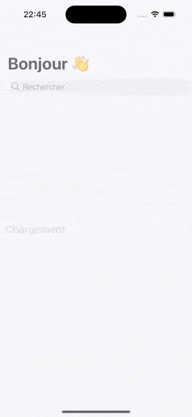
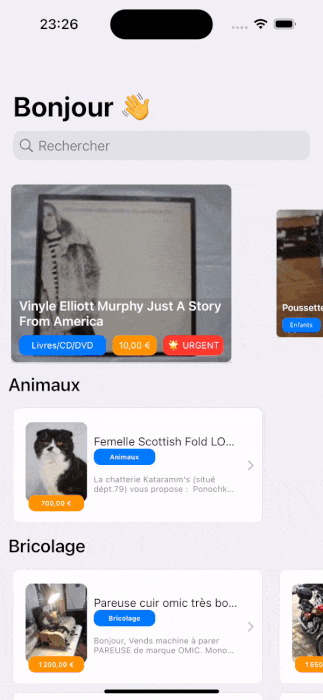

# PaperClip

A technical exercice for LeBonCoin

## Subject
> Créer une application universelle (iPhone, iPad) en Swift. Celle-ci devra afficher une liste d'annonces disponibles sur l'API https://raw.githubusercontent.com/leboncoin/paperclip/master/listing.json
> La correspondance des ids de catégories se trouve sur l'API https://raw.githubusercontent.com/leboncoin/paperclip/master/categories.json
> 
> Le contrat d'API est visualisable à cette adresse : https://raw.githubusercontent.com/leboncoin/paperclip/master/swagger.yaml
> 
> Les points attendus dans le projet sont:
> 
* Une architecture qui respecte le principe de responsabilité unique
* Création des interfaces avec autolayout directement dans le code (pas de storyboard ni de xib, ni de SwiftUI)
* Développement en Swift
* Le code doit être versionné (Git) sur une plateforme en ligne type Github ou Bitbucket (pas de zip) et doit être immédiatement exécutable sur la branche master
* Aucune librairie externe n'est autorisée
* Le projet doit être compatible pour iOS 14+ (compilation et tests)
* La récupération de toutes les données disponibles dans le swagger via un call API 
> 
> Nous porterons également une attention particulière sur les points suivants :
> 
* Les tests unitaires
* Les efforts UX et UI
* Performances de l'application
* Code swifty

> **Liste d'items**:
> Chaque item devra comporter au minimum une image, une catégorie, un titre et un prix. Un indicateur devra aussi avertir si l'item est urgent.
>
> 
> **Page de détail**: 
> Au tap sur un item, une vue détaillée devra être affichée avec toutes les informations fournies dans l'API.
> 
> Vous disposez d'un délai d'une semaine pour réaliser le projet.
> 
> Bonne chance. L’équipe iOS a hâte de voir votre projet !

# Project

On the 1st section you will found all the items that are flagged as "urgent" in the API. The rest of the items are grouped by category. A search feature is implemented by taping on the search bar  in the navigation bar.
The application is available in english and french language.

# Discussion
As describe in the subject this exercice is here to evaluate the candidate. In a limited time choices needs to be made by the candidate. I choosed to focus my time on UX/UI. This section is here to discuss about what could also be done with more time and have a critical point of view on my work.

## Tech
- Accessing a detail view of an item will currently call the listing API again. Accessing an item by his `id` rather than to pass the entire `struct` through view controller hierarchy give more flexibility to the detail view controller. It can be re-used more easily in case of a deep link evolution for example. In a real production application, a database would probably exists. This extra API call would have probably been replaced easily by an API call on this local database.

- Image loading cache could have been done storing images on disk either instead of a current static NSCache. This would ensure persitence of the cache after application relaunches.

## Design
- Native iOS UI elements have been preferred as much as possible.

- I noticed `thumb` URL images have often a higher quality than `small` ones. I don't know if it's the intended behaviour or if some mistakes are present in listing.json. I took the initiative to use `thumb` for detail view and `small` for the grid view.

- No information is made on the currency of the `price` in the API. I took the liberty to convert it to €/$/... using a `NumberFormatter` which will be based on the `Locale` of the user device. In a production application this initiative would have not been made because displaying the same number in €/$/... doesn't really make sense if it is not converted with the current rate.

- Using an horizontal scroll to browse a large number of items could be challenged. Given the amount of data of the current API and the purpose of the exercice. I found it legitimate to implement it that way if a search feature was also provided.

# Credits
- Logo generated using [dall-e-2](https://openai.com/dall-e-2/)